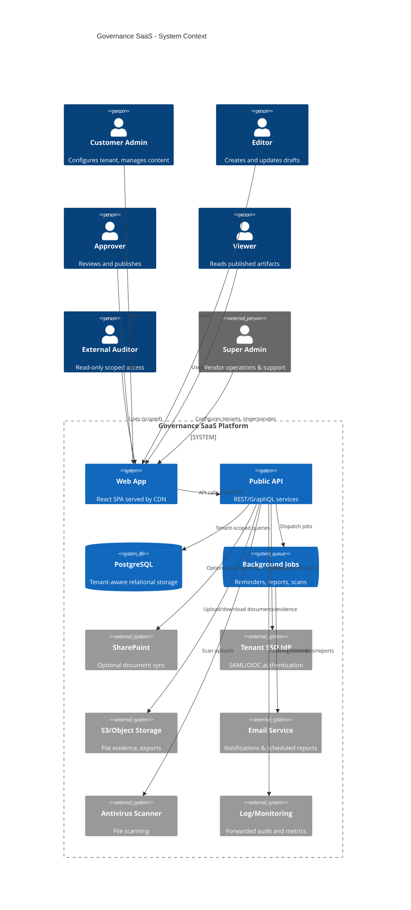

# Governance & Security SaaS Platform Architecture

## Overview
- **Purpose**: Multi-tenant SaaS for IT governance, ISO 27001 and NIS2 alignment.
- **Tech Stack**: React + Vite front end, Node.js/Express (TypeScript) backend, PostgreSQL with row-level security, Redis for caching/queues, MinIO/S3-compatible object storage, BullMQ for background jobs.
- **Deployment**: Dockerized services orchestrated via docker-compose (dev) and managed container service (e.g., AWS ECS Fargate) with PostgreSQL (RDS) and Redis (ElastiCache).
- **Modularity**: Core platform exposes Module SDK for pluggable modules (documents, questionnaires, controls, etc.).

## System Context Diagram


## Container Diagram (C4)
```mermaid
C4Container
    title Governance SaaS - Container View
    Person(admin, "Tenant Users")
    Person(superAdmin, "Super Admin")

    System_Boundary(govSaaS, "Governance SaaS") {
        Container(webClient, "Web Client", "React/TypeScript", "SPA served from CDN, consumes API")
        Container(api, "API Gateway", "Express/TypeScript", "REST + GraphQL, authentication, RBAC")
        Container(moduleRuntime, "Module Runtime", "Node.js services", "Loads core & plugin modules")
        Container(worker, "Worker Service", "Node.js + BullMQ", "Background jobs: reminders, exports, SharePoint sync")
        ContainerDb(postgres, "PostgreSQL", "Managed RDS", "Multi-tenant schema, row-level security")
        ContainerDb(redis, "Redis", "ElastiCache", "Queues, cache, rate limiting")
        Container(blob, "Object Storage", "S3/MinIO", "Documents, evidence, exports")
        Container(extAuth, "SSO Connectors", "SAML/OIDC Broker", "Per-tenant SSO")
        Container(extIntegration, "SharePoint Connector", "Node.js worker", "Sync documents via Microsoft Graph")
        Container(logging, "Observability Stack", "OpenTelemetry -> Loki/CloudWatch", "Logs, metrics, traces")
    }

    Rel(admin, webClient, "Uses")
    Rel(superAdmin, webClient, "Uses")
    Rel(webClient, api, "HTTPS, JWT/MFA")
    Rel(api, moduleRuntime, "Loads module controllers/services")
    Rel(api, postgres, "CRUD via Prisma/TypeORM with RLS")
    Rel(api, redis, "Session cache, rate limiting")
    Rel(api, blob, "Pre-signed URLs")
    Rel(api, worker, "Enqueue jobs")
    Rel(worker, redis, "BullMQ queues")
    Rel(worker, blob, "Generate exports")
    Rel(worker, extIntegration, "Invoke SharePoint sync jobs")
    Rel(extIntegration, spo, "Microsoft Graph API")
    Rel(api, extAuth, "Tenant SSO metadata")
    Rel(api, logging, "Emit structured logs/metrics")
    Rel(worker, logging, "Emit job logs/metrics")
```

## Module SDK & Plugin Model
- **Module Manifest** (`module.json`): name, version, nav label, feature flags, required permissions.
- **Backend contract**:
  - `registerRoutes(app, services)` to mount Express routers with tenant-aware middleware.
  - `definePermissions()` returns permission keys and default role mappings.
  - `getMigrations()` list of migration files executed by migrator.
  - `registerEventHandlers(eventBus)` subscribe to lifecycle events (e.g., `document.published`).
- **Frontend contract**:
  - `getNavItems(userPermissions)` returns nav entries.
  - `registerRoutes(router)` for React Router.
  - `registerStoreSlices(store)` for state modules.
- Modules packaged as npm workspaces to allow independent deployment and versioning.

## Multi-Tenancy & Isolation
- Tenants stored in `tenants` table with UUID primary key. Every record in tenant-scoped tables carries `tenant_id`.
- PostgreSQL Row Level Security ensures queries filtered by `tenant_id` for authenticated context.
- Separate S3 prefixes per tenant, encryption keys via KMS.
- Super Admin impersonation issues temporary JWT with `impersonated_tenant_id`, logged in audit trail.

## Background Jobs
- BullMQ queues: `notifications`, `reports`, `sync`, `maintenance`.
- Workers run idempotent jobs for reminders, scheduled reports, nightly data quality checks, SharePoint sync, antivirus re-scan.

## Eventing & Extensibility
- Internal event bus (Node EventEmitter or NATS optional) dispatches events (`document.submitted`, `workflow.stateChanged`, `control.tested`).
- Hooks allow modules (e.g., Risk Register) to respond to approvals/publish events for downstream automation.

## Observability & Ops
- OpenTelemetry instrumentation, log to JSON with tenant/user IDs.
- Health endpoints: `/health/live`, `/health/ready`.
- Metrics exported to Prometheus/Grafana.
- Feature flags via LaunchDarkly-compatible abstraction.

## Security Considerations
- All endpoints require tenant-scoped JWT with roles/permissions claims.
- MFA enforced for local auth; SSO can assert MFA.
- Secrets stored in cloud secret manager; environment variables only hold references.
- File uploads scanned via ClamAV before availability.
- Data retention policies enforced via scheduled jobs (auto-archive or delete).

## Future Modules
- Risk Register, Vendor Management, Asset Inventory, Business Impact Analysis, Year-Wheel scheduler using same Module SDK skeleton.

## Non-Functional Requirements
- **Performance**: API endpoints optimized with pagination, composite indexes (tenant_id + status) ensure list views <300 ms for 1k items. Redis caching for dashboard aggregates.
- **Availability**: Target 99.9% using multi-AZ RDS, ECS services with auto-scaling, S3 durability.
- **Scalability**: Stateless API, horizontal scaling, queue-based background jobs.
- **Security**: TLS 1.2+, strict CSP, rate limiting, anomaly detection with alerts.
- **Compliance**: Audit logging immutable, retention policies enforced per tenant, export/delete workflows for GDPR.

## Acceptance Criteria Traceability
- Super Admin flows: tenant creation, impersonation with audit log entry.
- Customer Admin: configure SSO, manage templates, execute questionnaires.
- Editors vs Approvers: enforced via workflow guards.
- Questionnaire answers link to controls via `control_links` & `linked_control_ids` arrays.
- Exports: background jobs produce PDF/Word with metadata/watermark.
- SharePoint integration toggled per tenant via `integration_configs`.
