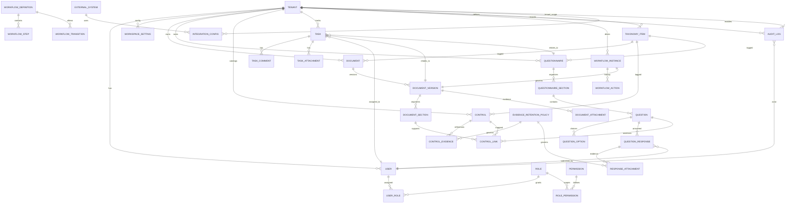

# Entity Relationship Diagram

```mermaid
erDiagram
    TENANT ||--o{ USER : has
    TENANT ||--o{ WORKSPACE_SETTING : config
    TENANT ||--o{ DOCUMENT : owns
    TENANT ||--o{ QUESTIONNAIRE : owns
    TENANT ||--o{ CONTROL : catalogs
    TENANT ||--o{ TASK : tracks
    TENANT ||--o{ WORKFLOW_INSTANCE : drives
    TENANT ||--o{ AUDIT_LOG : records
    TENANT ||--o{ TAXONOMY_ITEM : defines

    USER ||--o{ USER_ROLE : assigned
    ROLE ||--o{ USER_ROLE : grants
    ROLE ||--o{ ROLE_PERMISSION : scopes
    PERMISSION ||--o{ ROLE_PERMISSION : defines

    DOCUMENT ||--o{ DOCUMENT_VERSION : versions
    DOCUMENT_VERSION ||--o{ DOCUMENT_SECTION : segments
    DOCUMENT_VERSION ||--o{ DOCUMENT_ATTACHMENT : evidence

    QUESTIONNAIRE ||--o{ QUESTIONNAIRE_SECTION : organizes
    QUESTIONNAIRE_SECTION ||--o{ QUESTION : contains
    QUESTION ||--o{ QUESTION_OPTION : choices
    QUESTION ||--o{ QUESTION_RESPONSE : answered
    QUESTION_RESPONSE ||--o{ RESPONSE_ATTACHMENT : evidence
    QUESTION_RESPONSE }o--|| USER : submitted_by

    CONTROL ||--o{ CONTROL_EVIDENCE : references
    CONTROL ||--o{ CONTROL_LINK : mapped
    DOCUMENT_SECTION ||--o{ CONTROL_LINK : supports
    QUESTION ||--o{ CONTROL_LINK : assesses

    WORKFLOW_DEFINITION ||--o{ WORKFLOW_STEP : contains
    WORKFLOW_DEFINITION ||--o{ WORKFLOW_TRANSITION : allows
    WORKFLOW_INSTANCE ||--o{ WORKFLOW_ACTION : history
    WORKFLOW_INSTANCE ||--|| DOCUMENT_VERSION : governs

    TASK ||--o{ TASK_COMMENT : has
    TASK ||--o{ TASK_ATTACHMENT : has
    TASK }o--|| USER : assigned_to
    TASK }o--|| DOCUMENT_VERSION : relates_to
    TASK }o--|| QUESTIONNAIRE : relates_to

    AUDIT_LOG }o--|| USER : actor
    AUDIT_LOG }o--|| TENANT : tenant_scope

    TAXONOMY_ITEM ||--o{ DOCUMENT : tagged
    TAXONOMY_ITEM ||--o{ CONTROL : tagged
    TAXONOMY_ITEM ||--o{ QUESTIONNAIRE : tagged

    EVIDENCE_RETENTION_POLICY ||--o{ CONTROL_EVIDENCE : governs
    EVIDENCE_RETENTION_POLICY ||--o{ RESPONSE_ATTACHMENT : governs

    EXTERNAL_SYSTEM ||--o{ INTEGRATION_CONFIG : uses
    TENANT ||--o{ INTEGRATION_CONFIG : enables
```
